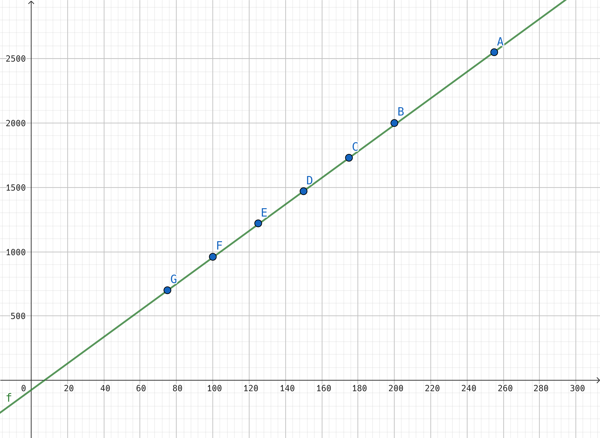

### setSpeed vs 2x pulses / sec

* Can see linear relationship between setSpeed x/255 duty cycle and measured 2x pulses / sec
* f: y = 10.3x - 75 was a rough eyeball on the relationship using Geogebra (23:37:27)
